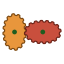
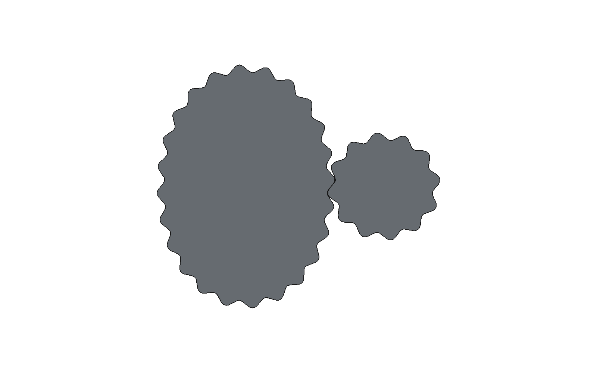
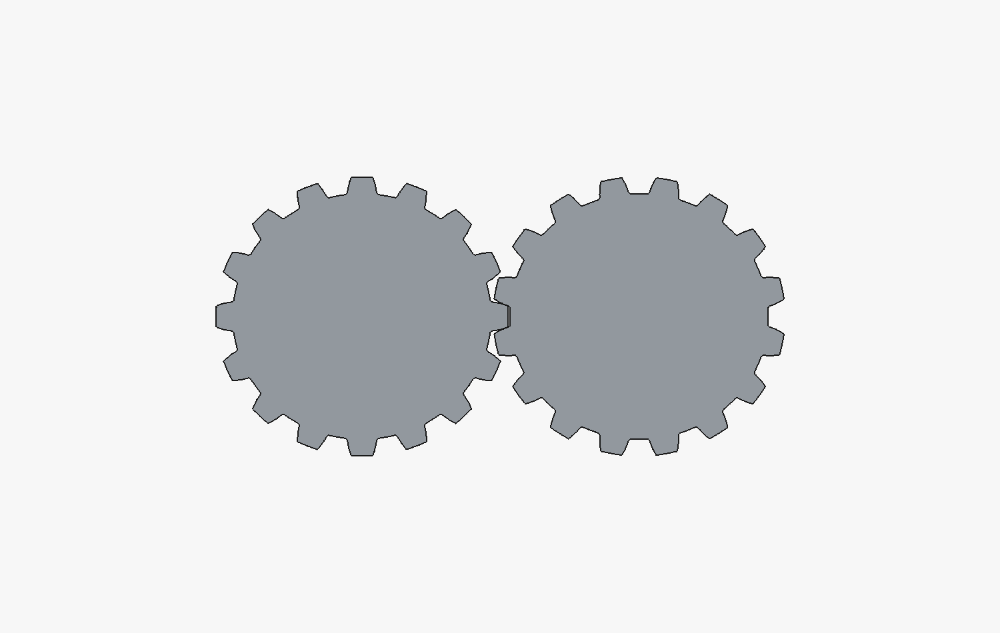
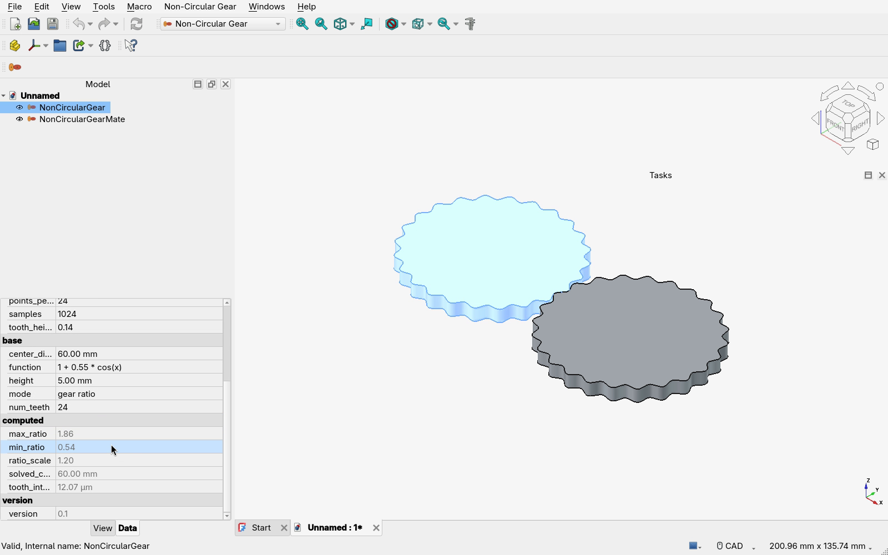
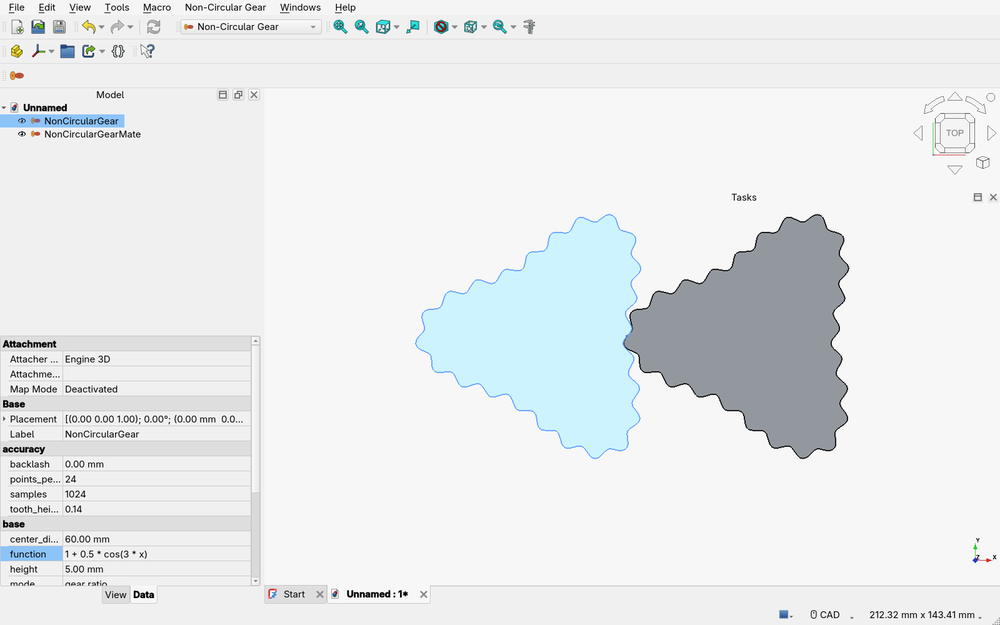

# freecad.noncirculargears

A FreeCAD workbench that turns a gear ratio function into two gears that mesh.

Give it `f(x)` over one turn of the first gear, `x` in radians from `0` to
`2*pi` and `f(x)` anywhere above zero, and one command leaves two solids in the
document, drawn on the line of centres in the position they mesh at.

```
f(x) = 1 + 0.55 * cos(x)        the first gear turns the second between
                                0.54 and 1.86 times its own speed
```



## Where it comes from

The pitch curve construction is [Julien Piellard's non-circular-gears
generator](https://github.com/piellardj/non-circular-gears) - both gears
reduced to their operating pitch lines, teeth laid on top as a wave - carried
over to FreeCAD. The document objects, the view provider, the attachment
handling and the PartDesign integration are [looooo's
freecad.gears](https://github.com/looooo/freecad.gears), which this workbench
imports rather than copies and therefore requires.

## Installing

Link or copy this directory into FreeCAD's user `Mod` directory, beside
`freecad.gears`:

    ln -s ~/dev/freecad.noncirculargears ~/.local/share/FreeCAD/v1-1/Mod/

Then pick **Non-Circular Gear** from the workbench list and use **Non-Circular
Gear > Gear Pair**.

Involute teeth are cut by [ncgears](https://github.com/kylebme/ncgears) and are
what a new pair starts on. It is still optional: without it a pair starts on
wave teeth instead, and asking for involute ones says what to install.

    pip install ncgears

## What it makes

Two objects. `NonCircularGear` carries every parameter and draws the driving
gear; `NonCircularGearMate` links to it, draws the gear that meshes with it,
and places itself - so its `Placement` is driven rather than edited, and
editing the driver rebuilds both.

**Gear Pair** puts them in the document and opens them in a dialog whose rows
are the driving gear's own properties, so a pair is set up as it is added and
the one in the view is rebuilt at every change. OK keeps it, Cancel takes it
back out, and the property editor reaches the same properties afterwards.

| property | |
|---|---|
| `mode` | whether `function` is the gear ratio or the first gear's pitch radius |
| `function` | `f(x)`, Python, with the `math` module's names in scope |
| `center_distance` | distance between the axes; solved for in pitch radius mode |
| `num_teeth` | teeth on the driving gear |
| `mate_turns`, `driver_turns` | turns each gear makes against the other |
| `height` | extrusion height; `0` leaves the bare outline |
| `tooth_style` | conjugate involute flanks, the default, or a wave laid on the pitch line |
| `tooth_height` | tooth height above the pitch line, as a fraction of the circular pitch |
| `pressure_angle` | angle the involute flanks press at; wave teeth have none |
| `backlash` | gap held open between the two tooth surfaces |
| `samples`, `points_per_tooth` | how finely `f(x)` and the outline are sampled |

and seven read-only ones: `solved_center_distance`, `ratio_scale`, `min_ratio`,
`max_ratio`, `mate_teeth`, and the two the last section is about,
`tooth_interference` and `transmission_error`.

## The two modes

**gear ratio.** `f(x)` is `w1 / w2`, the driving gear's speed over the driven
gear's. The centre distance only scales the pair, so it is taken as given.

**pitch radius.** `f(x)` is the first gear's pitch radius in millimetres, which
is the way in for a shape you already have. The centre distance is then solved
for instead of used, and `solved_center_distance` reports it.

Either way the second gear's shape falls out of the first's; the two readings
of "give me the shapes of two gears" meet in the same pipeline, since a ratio
of `f` is a radius of `a / (1 + f)` and a radius of `r` is a ratio of
`(a - r) / r`.

## How often the mate turns

`mate_turns` and `driver_turns` are how many turns each gear makes against the
other, and both start at 1. Raise `mate_turns` for a mate that turns faster
than the driver and comes out smaller than it; raise `driver_turns` for one
that turns slower and comes out bigger.

One period of the driver meshes with one period of the mate, so those two
counts are also how many periods each gear is built from - `mate_turns = 2` is
a driver of two periods turning a single-period mate twice over. That puts two
conditions on the rest of the parameters, and a pair that misses either is
refused rather than drawn wrong:

- `f(x)` has to repeat as often as the driver has periods, since the driver
  really does have that many identical ones. `1 + 0.45 * cos(2 * x)` for
  `mate_turns = 2`.
- `num_teeth` has to divide among those periods, since both gears' teeth stand
  at one pitch along the arc the two roll off together. The mate's own count
  follows from that and is reported as `mate_teeth`: 24 teeth turning 2:1
  leaves the mate 12.

Neither is asked of a mate that turns *slower*, which is one period of the
driver against several of the mate: any `f(x)` and any `num_teeth` will do, and
the mate comes out with `driver_turns` times as many teeth.



## Two things worth knowing

**Your `f(x)` may be scaled.** The second gear only closes into itself if the
integral of `1 / f` over the turn comes to a whole turn of it. In gear ratio
mode nothing else can fix that, so `f` is multiplied by whatever constant does,
and `ratio_scale` reports the factor. It is a constant, so the *variation* you
asked for survives: `2 + cos(x)` still swings by a factor of three between its
slowest and its fastest, whatever constant it is multiplied by. The average
ratio over a turn is therefore always the `mate_turns` against `driver_turns`
you asked for and never something in between. In pitch radius mode the shape is
kept exactly and the centre distance moves instead.

**Wave teeth are approximate; the rolling is not.** The pitch lines roll on each
other exactly - the contact stays on the line of centres and the delivered
ratio is the `f(x)` you asked for to a few parts in 10^5. `tooth_style = wave`
lays a sine wave along the arc length of each pitch line in antiphase, rather
than cutting conjugate flanks, so a tooth passes about a hundredth of its own
height into
the gap it meshes with. `tooth_interference` measures exactly that, over a
whole revolution, and `backlash` clears it: for the default pair, 0.012 mm of
interference on a 1.07 mm tooth, and `backlash = 0.1 mm` takes it to -0.079 mm.
Raising `num_teeth` lowers it too.



**`tooth_style = involute` needs none of that, and costs seconds.** ncgears cuts
flanks that are conjugate on the pitch line rather than laid over it, and the
pair comes back to be placed rather than approximated: 2.4e-7 degrees of
`transmission_error` for the default pair against 0.012 mm of interference for
the wave. It is what a new pair starts on, falling back to `wave` only where
ncgears is not installed. It takes five to fifteen seconds a pair rather than a
tenth of a second, and wants an `f(x)` SymPy can read; outlines already cut are
kept, so a rebuild that does not change them - the second gear, a style gone
back to, an edit undone - costs nothing. The two measures do not overlap - each
reads 0 for the other's teeth - and
[docs/involute-teeth.md](docs/involute-teeth.md) says why, along with what the
mapping onto ncgears is and where it refuses.

## Checking it

    freecadcmd tests/test_noncirculargears.py

A hundred and twenty-eight checks: both gears build as valid solids, the pitch
points meet on the line of centres, the delivered ratio is the one asked for,
the teeth clear each other and are counted off the built shapes, both modes
solve, four pairs that turn at something other than 1:1 come out turning what
they were asked to, an `f(x)` that goes negative, does not parse, is not finite,
reaches outside the `math` module or does not repeat as often as the turns need
is refused rather than drawn, the dialog is built and typed into rather than
described, a new pair comes up on involute teeth where ncgears is installed and
on wave teeth where it is not, and an involute pair is counted as it is rebuilt
to show that one cut serves both gears and is not paid for twice.

A run holds itself to 40% of the cores - `CPU_SHARE` at the top of the file -
because ncgears otherwise spreads every cut over the whole machine, which took
a run to 85% of it and left nothing to work on. That is why the checks take
longer than the sum of what they measure.

Forty-five of those are involute teeth. Forty need ncgears and are skipped with
a note without it, leaving eighty-eight that run either way - the other five
are the ones that check what is done and said when it is missing. To run the lot against
an ncgears kept out of FreeCAD's own environment, put it on the path for the
run:

    freecadcmd -P path/to/site-packages tests/test_noncirculargears.py

`tests/noncircular-gears.steps` drives the same thing through a real FreeCAD
window with [ReproCAD](https://github.com/latekvo/ReproCAD) - its header has the
command - and `docs/noncircular-gears.mp4` is that run: the pair built from one
menu entry, `f(x)` and `mate_turns` typed into the dialog with both gears
rebuilding behind it, what it came out at read off the property editor, and then
`f(x)` retyped there so both gears rebuild again.




